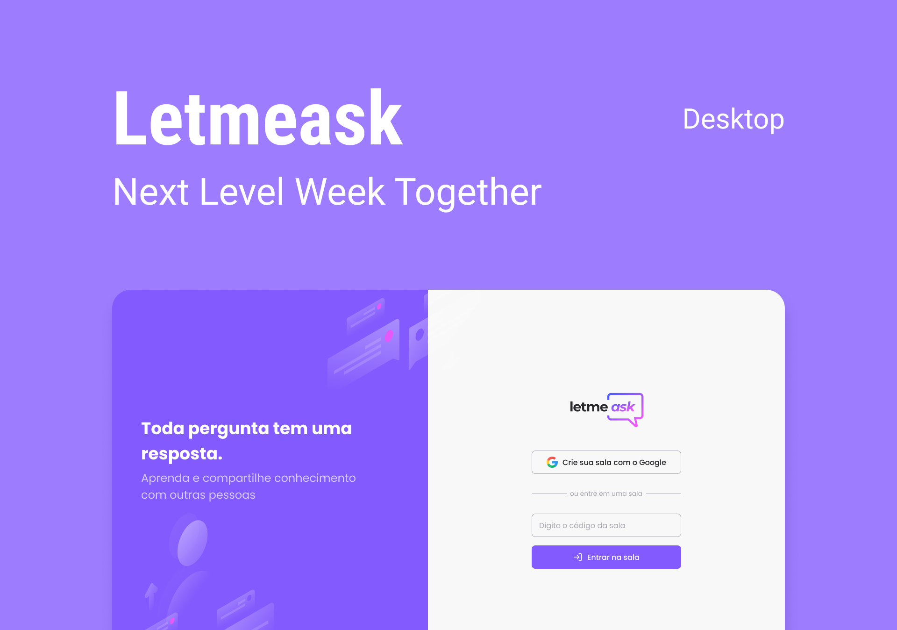
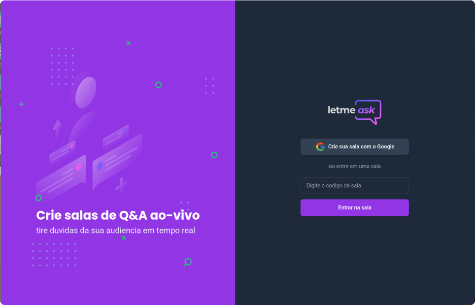
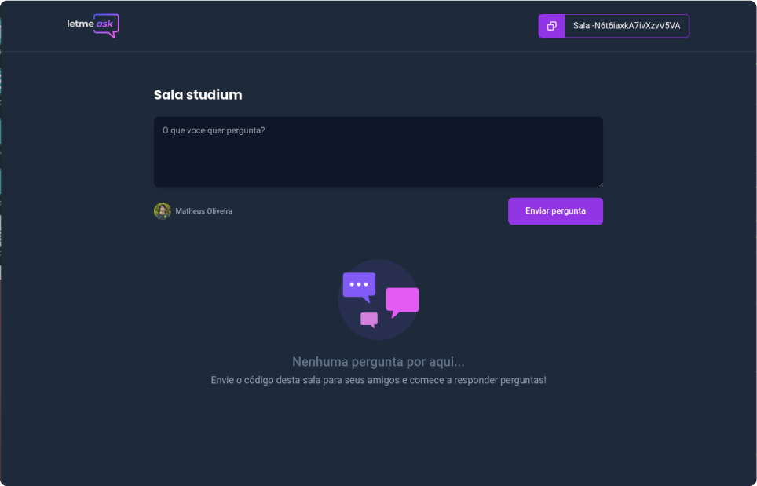
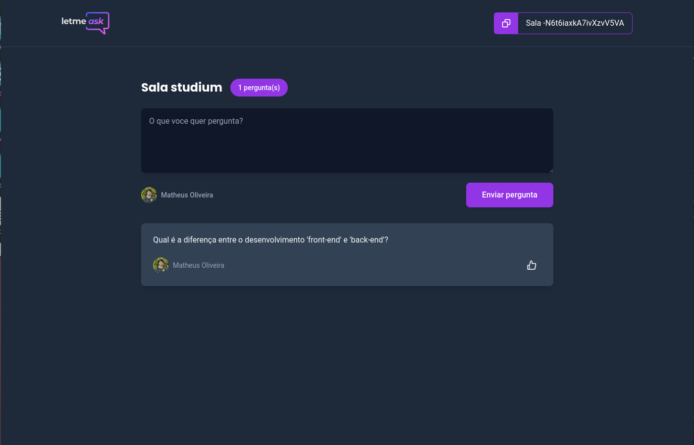

<p align="center">
  
</p>

<p align="center">
   
</p>

<br>

## 🧪 Tecnologias

Esse projeto foi desenvolvido com as seguintes tecnologias:

- [Firebase](https://firebase.google.com/)
- [TypeScript](https://www.typescriptlang.org/)
- [Tailwindcss](https://tailwindcss.com/)


## 🚀 Como executar

Clone o projeto e acesse a pasta do mesmo.

```bash
$ git clone https://github.com/MatheusFontenele/letMeAsk
$ cd letmeask
```

Para iniciá-lo, siga os passos abaixo:
```bash
# Instalar as dependências
$ yarn

# Iniciar o projeto
$ yarn start
```
O app estará disponível no seu browser pelo endereço http://localhost:3000.

Lembrando que será necessário criar uma conta no [Firebase](https://firebase.google.com/) um projeto para disponibilizar um Realtime Database e as chaves de acesso.

## 💻 Projeto

Letmeask é perfeito para criadores de conteúdos poderem criar salas de Q&A com o seu público, de uma forma muito organizada e democrática. 

Este é um projeto desenvolvido durante a **[Next Level Week Together](https://nextlevelweek.com/)**, apresentada dos dias 20 a 27 de Junho de 2021.

## 🔖 Layout

### Login page
<p align="center">
  
</p>

### Home page
<p align="center">
  
</p>

<p align="center">
  
</p>

### Home admin page
<p align="center">
  
</p>

Você pode visualizar o layout do projeto através do link abaixo:

- [Layout Web](https://www.figma.com/community/file/1009824839797878169/Letmeask) 


Feito com 💜 by Matheus 👋🏻
